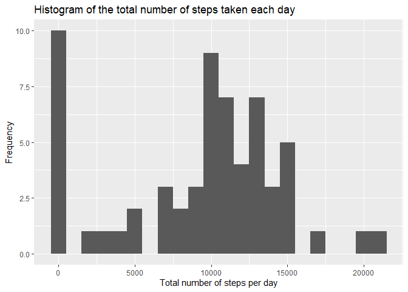
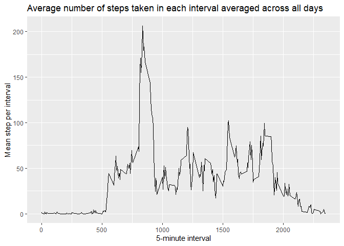
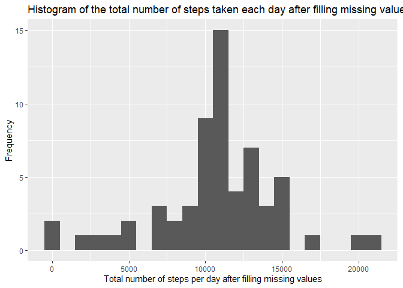
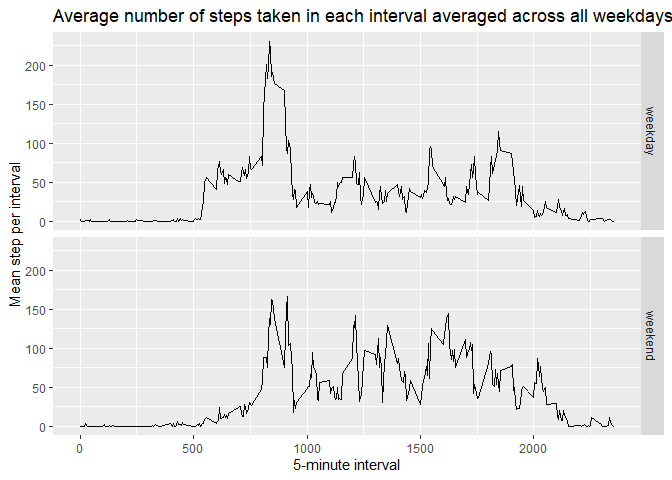

## Loading and preprocessing the data


```r
data <- read.csv(unz("activity.zip", "activity.csv"), head=TRUE)
library(lubridate)
data$date <- ymd(data$date)
```

## What is mean total number of steps taken per day?


```r
library(dplyr)
data <- as_tibble(data)
steps.day <- data %>%
  group_by(date) %>%
  summarise(sum=sum(steps, na.rm=TRUE))
library(ggplot2)
qplot(steps.day$sum, binwidth=1000, xlab="Total number of steps per day", ylab="Frequency", main="Histogram of the total number of steps taken each day")
```

<!-- -->

```r
print(paste("The mean total number of steps taken per day is", mean(steps.day$sum)))
```

```
## [1] "The mean total number of steps taken per day is 9354.22950819672"
```

```r
print(paste("The median total number of steps taken per day is", median(steps.day$sum)))
```

```
## [1] "The median total number of steps taken per day is 10395"
```

## What is the average daily activity pattern?


```r
pattern <- data %>%
  group_by(interval) %>%
  summarise(mean=mean(steps, na.rm=TRUE))

ggplot(pattern, aes(interval, mean)) +
  geom_line() + 
  xlab("5-minute interval") +
  ylab("Mean step per interval") +
  labs(title="Average number of steps taken in each interval averaged across all days")
```

<!-- -->

```r
print(paste("Interval", pattern$interval[which.max(pattern$mean)], "contains the maximum number of steps"))
```

```
## [1] "Interval 835 contains the maximum number of steps"
```

## Imputing missing values

```r
isna = is.na(data$steps)
print(paste("There are", sum(isna), "missing values in the dataset."))
```

```
## [1] "There are 2304 missing values in the dataset."
```

```r
print("The mean for 5 min interval is used to fill the missing data.")
```

```
## [1] "The mean for 5 min interval is used to fill the missing data."
```

```r
data.impute <- data

data.impute$steps[isna] <- pattern$mean[match(data.impute$interval[isna], pattern$interval)]


pattern.impute <- data.impute %>%
  group_by(interval) %>%
  summarise(mean=mean(steps, na.rm=TRUE))

steps.day.impute <- data.impute %>%
  group_by(date) %>%
  summarise(sum=sum(steps, na.rm=TRUE))
qplot(steps.day.impute$sum, binwidth=1000, xlab="Total number of steps per day after filling missing values", ylab="Frequency", main="Histogram of the total number of steps taken each day after filling missing values")
```

<!-- -->

```r
print(paste("After filling missing values, the mean total number of steps taken per day is", mean(steps.day.impute$sum)))
```

```
## [1] "After filling missing values, the mean total number of steps taken per day is 10766.1886792453"
```

```r
print(paste("After filling missing values, the median total number of steps taken per day is", median(steps.day.impute$sum)))
```

```
## [1] "After filling missing values, the median total number of steps taken per day is 10766.1886792453"
```

```r
print("After filling missing values, both mean and median become larger.")
```

```
## [1] "After filling missing values, both mean and median become larger."
```
## Are there differences in activity patterns between weekdays and weekends?

```r
data.impute <- mutate(data.impute, wd=wday(data.impute$date, week_start = getOption("lubridate.week.start", 1)))
data.impute$wd <- factor(data.impute$wd, levels=c(1:7), labels=c(rep("weekday", 5), rep("weekend", 2)))

pattern.wd <- data.impute %>%
  group_by(interval,wd) %>%
  summarise(mean=mean(steps, na.rm=TRUE))
```

```
## `summarise()` has grouped output by 'interval'. You can override using the
## `.groups` argument.
```

```r
ggplot(pattern.wd, aes(interval, mean)) +
  geom_line() +
  facet_grid(rows=vars(wd)) +
  xlab("5-minute interval") +
  ylab("Mean step per interval") +
  labs(title="Average number of steps taken in each interval averaged across all weekdays or weekends")
```

<!-- -->

